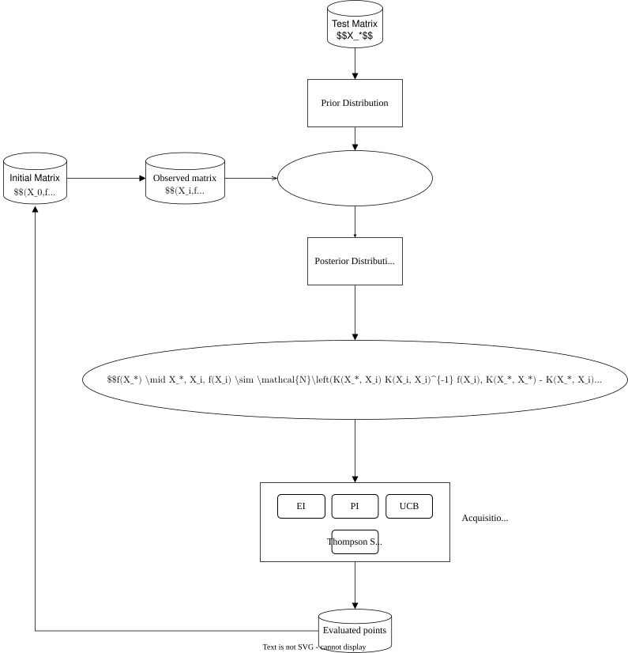

## Introduction

This project focuses on selecting optimal battery construction parameters using Bayesian optimization. The prior distribution is modeled as a Gaussian process regression, which is iteratively updated based on observed values. 本文中涉及的变量均为离散值。

## Project Overview

A total of two rounds of Bayesian optimization were conducted, utilizing four acquisition functions (EI, UI, PCB, and Thompson Sampling) to evaluate and rank the optimal parameters based on weighted scores. The results of the first round of optimization are as follows:

| Category | Weight Sum | Count |
|----------|------------|-------|
| 1323     | 11         | 3     |
| 2314     | 8          | 3     |
| 1322     | 7          | 2     |
| 1314     | 5          | 3     |
| 1313     | 4          | 1     |

Among them, 1322 already exists in the existing formula, so the other four formulas are selected. (For the specific meaning of the formulas, please refer to the article.)
Experiments were conducted, and the results were substituted into the second round of Bayesian optimization to obtain the parameters with the highest weight.

These parameters were used for the preparation of lithium metal batteries and subsequent aqueous batteries, yielding the expected results.

The optimization results of the two rounds in this article can be obtained as follows:
First round of experiments: Run `python -m main` directly using the default config.
Second round of experiments: Modify the `config.json` file by setting `epoch` to `2`, and run `python -m main` again.
## Installation & Usage

1. Clone the repository via `git clone https://github.com/WangGroupFDU/Bayes_optimization.git`
2. Install the required packages via `pip install -r requirements.txt`
3. Run the script via `python main.py` with default config.
4. The output files are located in the `output` folder.

### Obtain the Best Experimental Formula Using Your Own Files
1. Place your input files in the `input/data` folder and modify the `input_file_name` in `config.json`.
2. If your file has input and output columns different from the default setting (4 and 3 in this project), modify the `input_columns` and `output_columns` in `config.json`.
3. We provide both a pure mathematical implementation of Bayesian optimization and a Bayesian optimization implementation based on the Gpy library. Except for the Thompson sampling method (see  [Note](#note), as the sampling objects are different), the results are identical. You can modify the `use_gpy` parameter in `config.json` to choose the specific implementation method.

## Note:
- Bayesian optimization is implemented using both Gpy and pure mathematics. 
- The model-based prediction results are the same for both, but the results of Thompson sampling differ. 
- This is because the sampling objects are different. 
    - The former is based on the posterior distribution (excluding noise values), while the latter is based on the predicted object values.
